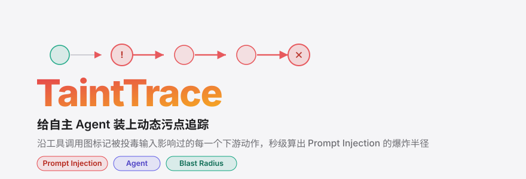
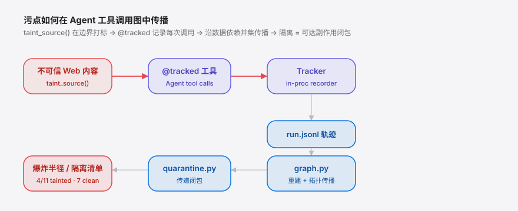

<div align="right"><sub><a href="./README.en.md">English</a>&nbsp;&nbsp;⇄&nbsp;&nbsp;<b>简体中文</b></sub></div>

<picture>
  <source media="(prefers-color-scheme: dark)" srcset="./assets/hero-dark.svg">
  <source media="(prefers-color-scheme: light)" srcset="./assets/hero-light.svg">
  
</picture>

<p><sub>TaintTrace 是一个污点追踪工具：当一次 Prompt Injection 落地，它沿 Agent 工具调用图算出这次注入的爆炸半径。</sub></p>

<p align="center">
  <a href="./LICENSE"></a>
  <a href="https://github.com/SuperMarioYL/tainttrace/releases"></a>
  <a href="https://github.com/SuperMarioYL/tainttrace/actions/workflows/ci.yml"></a>
  
  
  
</p>

**护栏只在边界拦截；一旦注入溜进来，你需要一个传播模型才能找出它污染了哪些动作 —— 这就是 TaintTrace。**

当一次 Prompt Injection 或 role-confusion 漏洞落在自主 Agent 内部时，真正棘手的失败动词是「传播」：一个被投毒的 token 不会只产出一个坏输出，它会沿着一连串下游工具调用、文件写入和记忆更新悄悄施加影响。今天安全工程师明知发生了注入，却没有任何机械化的办法回答「最近 200 个 Agent 动作里，哪些被它污染了？」—— 只能逐行翻日志、靠猜。TaintTrace 把安全数据流分析里的**动态污点追踪**搬进 Agent 运行时：每一个不可信 token（Web 内容、工具输出）携带一个污点标签，沿工具调用图传播，于是事后可以确定并隔离它影响过的每一个动作。这正是 [role-confusion.github.io](https://role-confusion.github.io)（HN 164 分）那场讨论指向的心智模型 —— 把注入当作信任传播问题，而非字符串过滤问题 —— TaintTrace 把这个标签变成可计算的。

## 目录

- [架构](#架构)
- [安装](#安装)
- [快速开始](#快速开始)
- [用法](#用法)
- [Demo](#demo)
- [为什么需要它](#为什么需要它)
- [vs Ponytrail](#vs-ponytrail)
- [路线图](#路线图)
- [许可协议](#许可协议)

<h2 id="架构"> 架构</h2>

单个 Python 库 + 一个 CLI，无服务、无数据库。运行期用 `taint_source()` 在边界打标、`@tracked` 记录每次工具调用；事后 CLI 从 `run.jsonl` 重建工具调用图、跑传播、算出隔离清单。

<picture>
  <source media="(prefers-color-scheme: dark)" srcset="./assets/atlas-dark.svg">
  <source media="(prefers-color-scheme: light)" srcset="./assets/atlas-light.svg">
  
</picture>

| 模块 | 职责 |
|---|---|
| `label.py` | 污点标签 / 标签集 + 并集传播原语 |
| `wrap.py` | `@tracked` 装饰器 + `taint_source()` 边界助手 |
| `graph.py` | 重建工具调用图 + 拓扑传播 |
| `quarantine.py` | 传递闭包 + 副作用分类 → 爆炸半径 |
| `tracker.py` | 顶层门面：录制 JSONL 轨迹、算爆炸半径 |
| `cli.py` | `report` / `demo` 命令（typer + rich） |

<h2 id="安装"> 安装</h2>

```bash
git clone https://github.com/SuperMarioYL/tainttrace.git
cd tainttrace
pip install -e ".[dev]"        # 或 uv pip install -e ".[dev]"
```

<h2 id="快速开始"> 快速开始</h2>

冷启动到看见红色隔离清单，三条命令：

```bash
python examples/poisoned_web_demo.py        # 跑一遍被投毒的 Web 抓取
tainttrace report --trace run.jsonl --graph # 渲染工具调用图 + 隔离清单
tainttrace report --trace run.jsonl --json  # 机器可读的爆炸半径（给 CI / 事件工具）
```

<details><summary>示例输出</summary>

```
╭────────────────────────────────────────────────────────────────╮
│ 4 of 11 actions tainted  ·  2 to quarantine  ·  7 proven clean │
╰────────────────────────────────────────────────────────────────╯
Untrusted sources: web:cve-blog

      Quarantine list — side-effecting actions to roll back
 #  call id        tool         hops  tainted by     why
 1  write_file-7   write_file       0  web:cve-blog   poisoned web page (prompt injection)
 2  git_commit-9   git_commit       0  web:cve-blog   poisoned web page (prompt injection)
```

</details>

<h2 id="用法"> 用法</h2>

把 TaintTrace 接进你现有的 Agent 只要两步：给每个工具加 `@tracked`，在不可信内容进入处包一层 `taint_source()`。

```python
from tainttrace import Tracker, tracked, taint_source

tracker = Tracker(path="run.jsonl").activate()

@tracked                       # 只读工具，自动判定无副作用
def web_fetch(url): ...

@tracked(side_effect=True)     # 写文件 = 副作用，进入隔离判定
def write_file(path, body): ...

# 在边界给不可信内容打标
page = taint_source(web_fetch(url), source_id="web:blog", reason="抓取的网页")
write_file("notes.md", summarize(page))   # 污点沿数据依赖传播到这次写入

report = tracker.blast_radius()
print(report.headline())       # "4 of 11 actions tainted, 7 proven clean"
```

常用命令与 API：

- `tainttrace report --trace run.jsonl` —— 渲染红色隔离清单。
- `tainttrace report --trace run.jsonl --json` —— 输出爆炸半径 JSON（隔离非空时进程退出码为 1，便于 CI 卡门）。
- `tainttrace demo` —— 无需任何文件，直接跑内置的被投毒 Web 场景。
- `Tracker.quarantine_from_source(source_id)` —— 把爆炸半径限定到某一个命名注入源。

完整示例见 [`examples/poisoned_web_demo.py`](./examples/poisoned_web_demo.py)。

<h2 id="demo"> Demo</h2>

注入一次被投毒的 Web 结果 → 看污点标签沿工具调用图传播 → 红色隔离清单亮起（11 个动作中 4 个被污染，7 个被证明干净）。


<h2 id="为什么需要它"> 为什么需要它</h2>

护栏 / 输入过滤器只做一件事：在边界拦截可疑输入。它们是无状态、边界局部的 —— 没有传播模型，一旦有东西溜过去，它们对「事后这东西又影响了什么」无能为力。审计日志（如 Ponytrail）记录了「发生了什么」，但把可信来源和注入来源记成无差别的同一条流，事后无法区分。TaintTrace 补的正是这道缝：在每个数据的**源头**打上信任标签并沿工具调用图带着走，于是注入落地后，爆炸半径从手工考古变成一次确定性查询 —— 返回需要回滚的精确动作集合。

<h2 id="vs-ponytrail">vs Ponytrail</h2>

[Ponytrail](https://github.com/0xroylee/ponytrail) 是最贴近的相邻项目：一个本地的 Agent 编辑审计轨迹。两者互补 —— 诚实地说，Ponytrail 在「人类可读的时间线」上做得更顺手。

| 能力 | TaintTrace | Ponytrail |
|---|:---:|:---:|
| 记录 Agent 动作序列 | ✓ | ✓ |
| 区分可信来源 vs 注入来源 | ✓ | — |
| 沿工具调用图做污点传播 | ✓ | — |
| 计算注入的传递爆炸半径 | ✓ | — |
| 现成的人类可读编辑时间线 UI | 部分 | ✓ |

<h2 id="路线图"> 路线图</h2>

- [x] **m1** — 污点标签附着到不可信输入，并沿记录的工具调用图传播
- [x] **m2** — 给定一次事件，计算被污染动作的传递闭包并产出隔离报告
- [x] **m3** — 即插即用 wrapper + 60 秒内的被投毒 Web 示例，产出红色隔离清单
- [ ] 对流行 Agent 框架（LangChain / LlamaIndex 工具调用层）的自动插桩
- [ ] 多 Agent 队列归因 + 跨会话 diff
- [ ] 事件复盘 dashboard（污点图可视化）

<h2 id="许可协议"> 许可协议</h2>

MIT 开源，无付费墙、无托管层。欢迎在 [Issues](https://github.com/SuperMarioYL/tainttrace/issues) 反馈问题（带上真实 trace 最好），或直接提 PR。

## Share this

```
TaintTrace — compute a Prompt Injection's blast radius across your Agent's tool graph. Drop in @tracked + taint_source(), replay the trace, get a red quarantine list. MIT, OSS. https://github.com/SuperMarioYL/tainttrace
```

<p align="center"><sub><a href="./LICENSE">MIT</a> © 2026 SuperMarioYL</sub></p>
